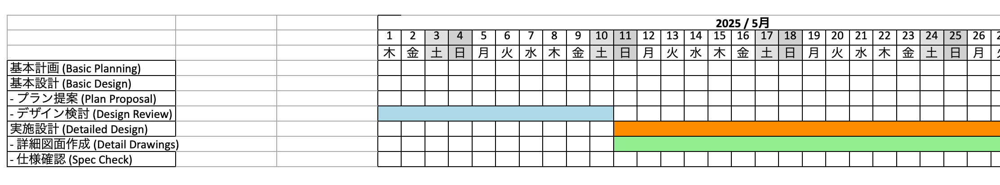

# Excel Project Schedule Generator

## Description

This Python script automatically generates a project schedule, similar to a Gantt chart, within an Excel (`.xlsx`) file. It creates headers for Year/Month, Day Number, and Day of the Week, and then plots tasks as colored horizontal bars representing their duration based on user-provided start and end dates.

The script is designed to replicate the visual style of detailed planning schedules, like the one shown in the initial request example.

## Features

* Generates calendar headers spanning specified months.
* Includes Year/Month merged headers, Day numbers, and Day of the Week (defaults to Japanese: 月, 火, 水, 木, 金, 土, 日).
* Customizable start date (Year, Month) and schedule duration (number of months).
* Plots tasks as colored timeline bars using merged cells based on defined start/end dates.
* Allows tasks to be placed on specific rows within the schedule.
* Applies basic Excel formatting:
    * Grid borders (thin lines).
    * Centered alignment for headers.
    * Background colors for timeline bars.
    * Optional weekend shading for date columns.
* Configurable number of columns for task descriptions before the date grid.
* Outputs a standard `.xlsx` Excel file.

## Requirements

* Python 3.6 or higher
* `openpyxl` library

## Installation

1.  Make sure you have Python 3 installed.
2.  Clone this repository or download the Python script (`.py` file).
3.  Install the necessary library using pip:
    ```bash
    pip install openpyxl
    ```

## Configuration

Before running the script, you need to configure it according to your project needs. Open the Python script file (e.g., `generate_schedule.py`) in a text editor and modify the variables within the `--- Configuration ---` section:

1.  **Date Range:**
    * `start_year`: The year your schedule should begin (e.g., `2025`).
    * `start_month`: The month your schedule should begin (1-12).
    * `num_months`: The total number of consecutive months to display.

2.  **Output File:**
    * `output_filename`: The desired name for the generated Excel file (e.g., `"project_schedule.xlsx"`).

3.  **Layout:**
    * `task_col_count`: The number of columns to reserve at the beginning for task names or other information (e.g., `3`).
    * `header_row_count`: The number of rows used by the date headers (typically `3` for Month/Day/Weekday).

4.  **Task Data:**
    * Modify the `tasks` list. This list contains dictionaries, where each dictionary represents one task bar on the schedule.
    * **Task Dictionary Format:**
        ```python
        {
            'name': 'Your Task Description',  # Text displayed (usually in the first column)
            'row_offset': 1,                  # Row number *below* the header rows (1 = first row, 2 = second, etc.)
            'start': 'YYYY-MM-DD',            # Start date of the task bar
            'end': 'YYYY-MM-DD',              # End date of the task bar (inclusive)
            'color': 'HEXCOLOR'               # Background color (e.g., 'FFFF00' for yellow, 'ADD8E6' for light blue)
        }
        ```
    * Add, remove, or modify dictionaries in the `tasks` list to match your project plan. Ensure the `row_offset` corresponds to the desired visual row for the task.

## Usage

1.  Configure the script as described above.
2.  Open your terminal or command prompt.
3.  Navigate to the directory where you saved the Python script.
4.  Run the script using the Python interpreter:
    ```bash
    python gen_timeline.py
    ```
5.  The script will print progress messages to the console.

## Output

Upon successful execution, an Excel file (named according to `output_filename`, e.g., `project_schedule.xlsx`) will be created in the same directory as the script. This file contains the generated schedule.



## Customization

* **Language:** The `weekdays_jp` list can be modified to display weekdays in a different language.
* **Styling:** Modify the `openpyxl.styles` objects (e.g., `thin_border`, `center_align`, `header_font`, `PatternFill`) within the script to change fonts, border styles, colors, or alignment.
* **Data Source:** For many tasks, consider reading the `tasks` data from an external source like a CSV file or database instead of hardcoding it in the script.
* **Advanced Features:** The script can be extended to handle task dependencies, milestones, or more complex formatting logic.